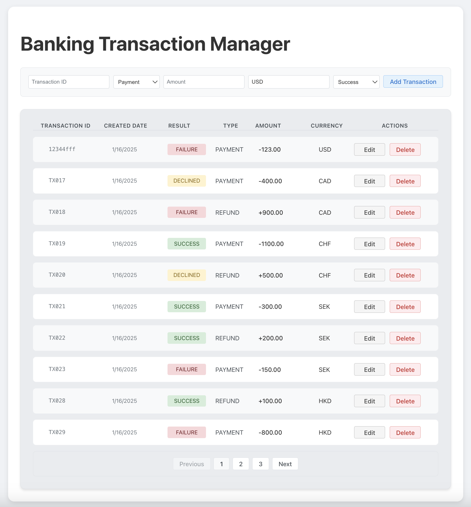

# Banking transaction management

## Main features
- View all transactions with pagination
- Add a new transaction
- Edit an existing transaction
- Delete a transaction

## How to run the application
NOTE: In this project, BASE_URL is set to `http://localhost:8080` by default in file `config.ts`, so you need to make sure the [backend service](https://github.com/xlavid/bank-transaction-server) is running before you use the app.


### run app locally
Node version should be larger than 20
npm version should be larger than 10


use `npm run dev` to run the app locally

### run app in docker
To run the React application in a Docker container, could run command below:

```bash
sh start_app.sh
```

After running these commands, you can access the app at `http://localhost:3000`.

Note: Make sure your API URL in the app is configured correctly to reach your backend service from the containerized environment.

## Dependency Purposes
### Production Dependencies
- `react`: Core React library for building user interfaces
- `react-dom`: React's DOM rendering functionality

### Development Dependencies
#### Build Tools
- `vite`: Modern build tool and dev server with HMR support
- `@vitejs/plugin-react-swc`: Fast React compiler for Vite

#### TypeScript Support
- `typescript`: TypeScript language support and compiler
- `@types/react`: TypeScript definitions for React
- `@types/react-dom`: TypeScript definitions for React DOM

#### Code Quality
- `eslint`: JavaScript/TypeScript linter
- `eslint-plugin-react-hooks`: ESLint rules for React Hooks
- `eslint-plugin-react-refresh`: Support for React Fast Refresh
- `@eslint/js`: JavaScript-specific ESLint rules
- `globals`: Global variable definitions for ESLint